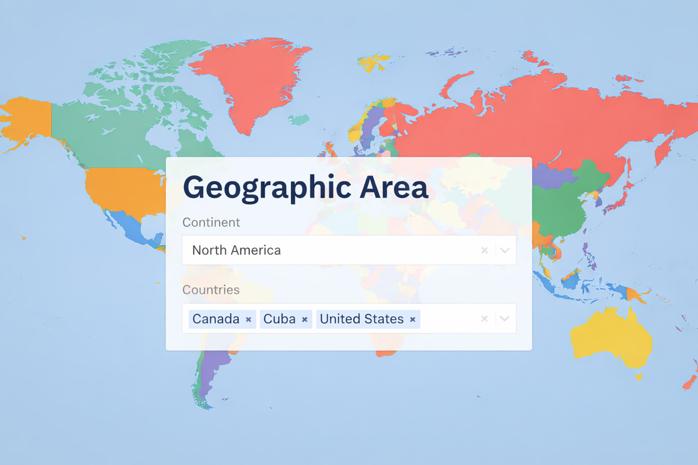

# DatoCMS Plugin Geographic Area



This DatoCMS plugin includes a FieldExtension applicable to a JSON field: it will display 2 fields for selecting a continent and one or more countries of the selected continent.
Optionally it's possible to display only the countries selector, just activate the switch.

## Instructions

After installing the plugin, you'll need to add a new JSON field type to a block or model, go to the Presentation tab, and select "Geographic Area" for the Field editor.

## Usage

The data structure will be a stringified JSON object with the following structure:

```json
{
  "continent": "north-america",
  "countries": ["canada", "cuba"]
}
```

_Note_: if the flag to display only the countries is on, then the continent value will be null, i.g.:

```json
{
  "continent": null,
  "countries": ["canada", "cuba"]
}
```

<br/>
<hr/>
<p>Developed with love by&nbsp;
    <a href="https://goodbase.studio/">goodbase</a>
</p>
